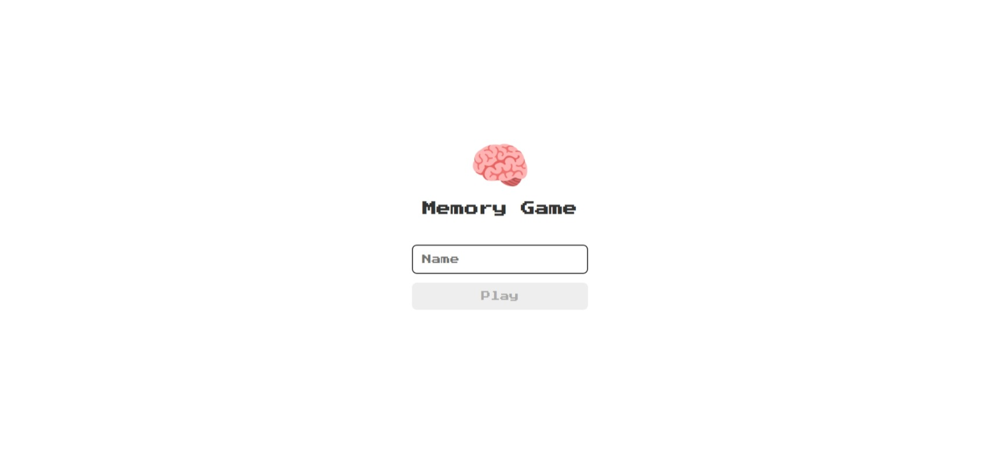
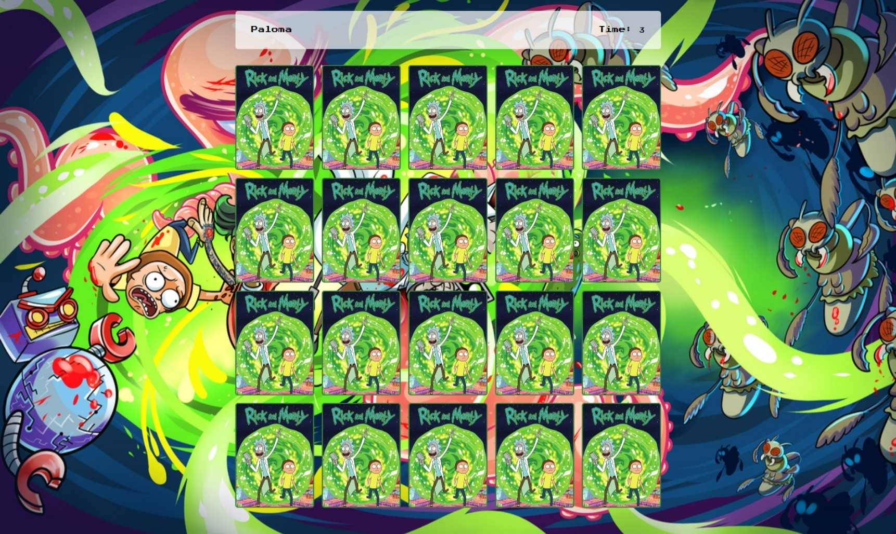
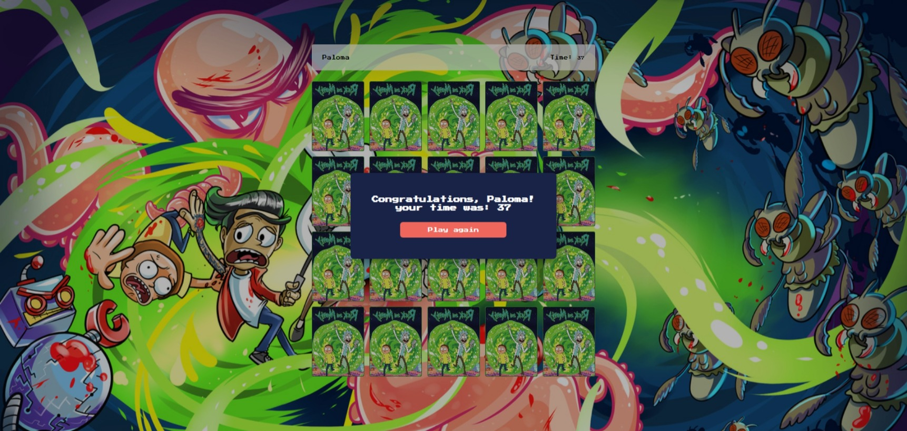

<h1 align="center">🧠 Memory Game</h1>

Memory game with login screen, timer and play again option!  
Developed in JavaScript.

---

 
 

Login

  

Game

  

Play again

  

 
 

# 🔨 Technologies

 
 

# 💻 Project

As soon as the user opens the game for the first time, he will be asked for a name to start, then the player is redirected to the game, with a timer and the name that was requested on the initial screen, after finishing revealing all the cards, it is an alert is displayed with the duration of the current game and the option to play again. Functions, arrays, events, and localstorage were worked on in this project.

 

# 🖱 You can access here

<a href="http://memory-game-beta-drab.vercel.app/">click here 🥰</a>

 

---

 made with ❤ by <a href="https://www.instagram.com/palomarodrigsb" target="_blank">@palomarodrigsb</a>

